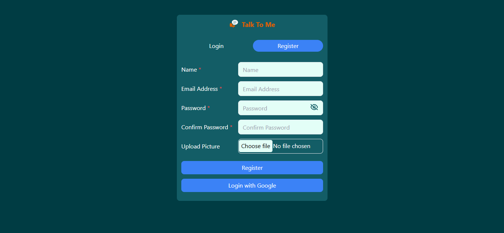

<h1 style="text-align: center;" >
Talk to me
</h1>

A real-time chat application built with the MERN stack (MongoDB, Express, React, Node.js). This application supports one-on-one messaging as well as group messaging, enabling users to communicate in real-time.

## Table of Contents

- [Features](#features)
- [Technologies Used](#Technologies-Used)
- [Demo](#demo)
- [Screenshots](#screenshots)
- [Installation](#installation)

## Features

The main features and functionalities of Talk to me are:

- **One-to-One Messaging:** Allows users to send direct messages to each other in real-time.
- **Group Messaging:** Enables users to create groups, update group names, and add/remove members.
- **Real-Time Updates:** Powered by Socket.IO for instant message delivery and notification.
- **User Authentication:** Supports both email/password-based login with JWT (JSON Web Tokens) and Google OAuth login.
- **Message History:** Stores message history in MongoDB, which can be accessed upon reconnection.
- **Responsive UI:** The user interface adapts to different screen sizes, providing a seamless experience on desktop, tablet and mobile devices.

## Technologies Used

- **Frontend:** React.js
- **Backend:** Node.js with Express.js
- **Database:** MongoDB
- **Real-Time Communication:** Socket.IO
- **Authentication:** JWT (JSON Web Tokens) and google Auth
- **Styling:** CSS / Tailwind CSS / SVGs

## Demo

### Check the the project live

Deployed link: https://talk-to-mee.netlify.app/

## Screenshots

**Sign Up and Sign In**

**Home Page**

**Profile Detail**

**Search user to message**

**Messages**

**Group**

## Installation

To run the project locally, follow these steps:

1. **Clone the Repository:** `git clone https://github.com/anandprakash01/talk-to-me`.

2. **Backend/Server Setup:**

   - Navigate to the project directory: `cd talk-to-me`.
   - Create a .env file in the server directory and add your environment variables (such as MongoDB URI, JWT secret key, etc.)
   - Install dependencies: `npm install`.

3. **Frontend Setup (React):**

   - Navigate to client in the project directory: `cd talk-to-me/client`.
   - Install dependencies: `npm install`.

4. **Running the Application:**
   - Start the backend/server: `npm start`.
   - Start the frontend/client: `npm run dev`.

Good luck with your project! 🚀
